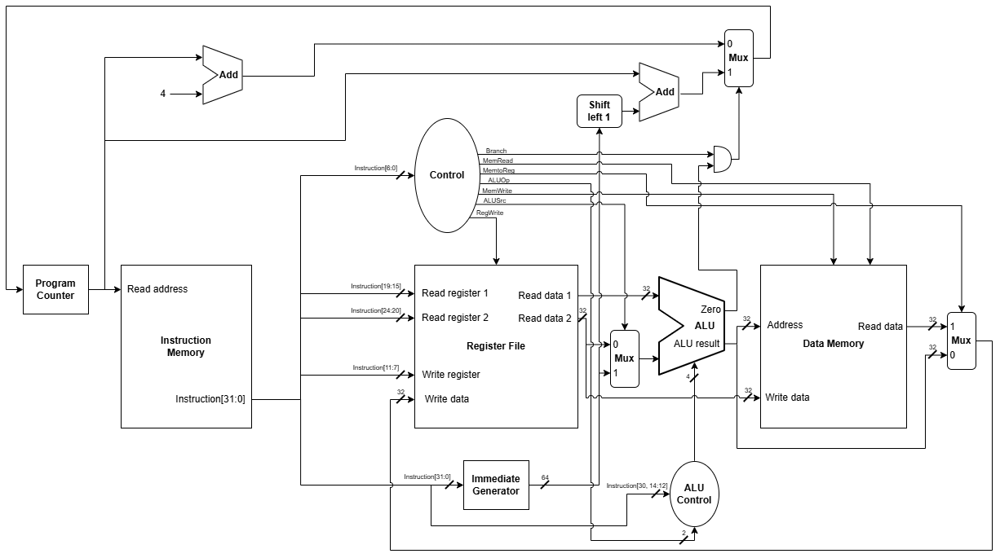
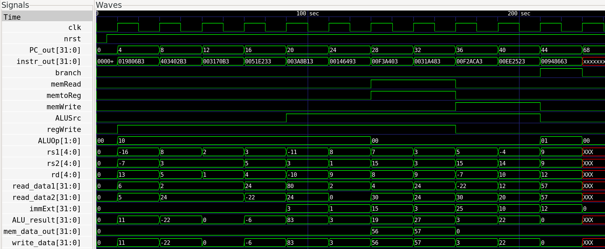

# Single-Cycle RISC-V CPU

A single-cycle RISC-V CPU implemented in SystemVerilog, 
simulated with Icarus Verilog/GTKWave and deployed to an UPduino v3.1 
(iCE40 UP5K) FPGA. Architecture is currently being expanded to a 5-stage
pipelined RISC-V CPU.

## Features
- RV32I instruction set (R/I/S/B formats)
- Single-cycle datapath implemented according to "Computer Organization and Design" by David A. Patterson and John L. Hennessy
- Verified through waveform analysis and demonstrated functionality on FPGA with LED outputs

## Architecture


## Getting Started
After installations of Icarus Verilog, GTKWave, and apio, the CPU can be simulated and then deployed on an FPGA with the following Linux workflow. For individual module simulations, replace the asterisk in src/*.sv with the module name and replace tb_top in tb/tb_top.sv with the correct testbench.
### Simulation
```bash
iverilog -g2012 -o sim.vvp src/*.sv tb/tb_top.sv
vvp sim.vvp
gtkwave waveform.vcd
```

The waveform displays the successful execution of a series of instructions written into the instruction memory module.

### FPGA
```bash
apio build
apio upload
```


## Challenges / Lessons Learned
Most of the debugging process took place during top module simulation and deployment onto the FPGA. In hindsight, all of the issues encountered during the top module simulation could've been avoided with a deep understanding of the RTL design, especially dealing with how data is transferred from data memory to the register file when loading words (with the immediate mimicking a pointer) and how data is transferred in the opposite direction when storing words. Cramming the CPU onto the FPGA required moving some assign statements into clocked blocks to decrease LUTs used.

## License
MIT
